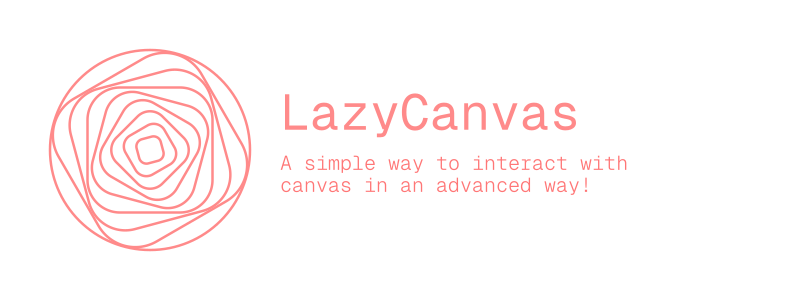

[](https://www.npmjs.com/package/@nmmty/lazycanvas)
[](https://www.npmjs.com/package/@nmmty/lazycanvas)

A simple way to interact with [`@napi-rs/canvas`](https://github.com/Brooooooklyn/canvas) in an advanced way!
LazyCanvas provides you with classes and methods to interact with canvas more easily. 

## Installation
```bash
$ npm install @nmmty/lazycanvas@latest
```

## Documentation

Will be available soon!

## Font Generation

[See how to generate fonts](./scripts/FontsGenerate.md)
